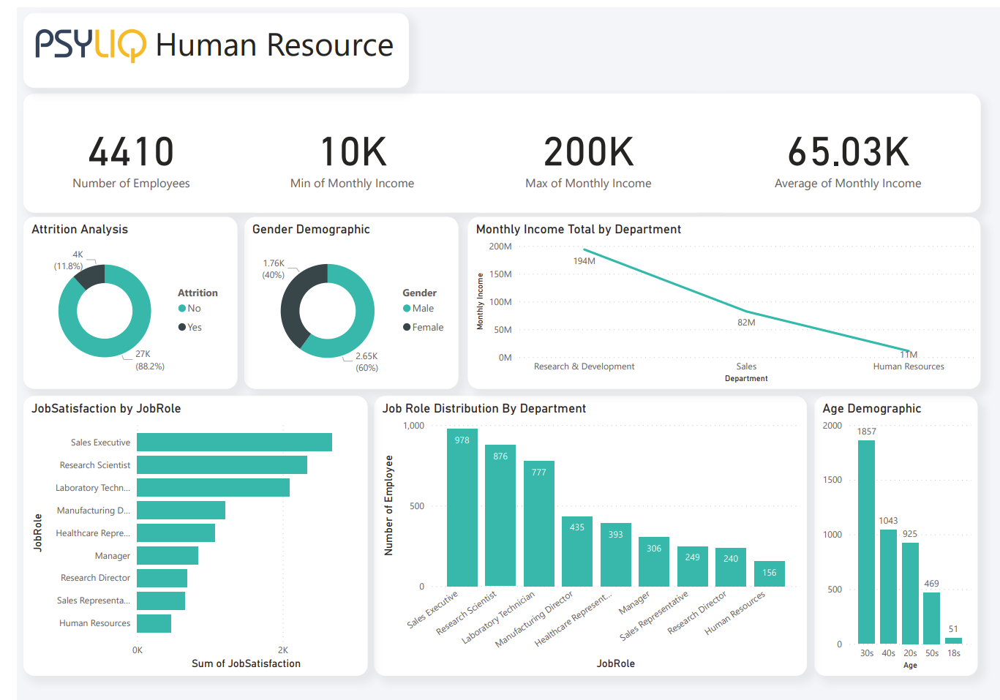
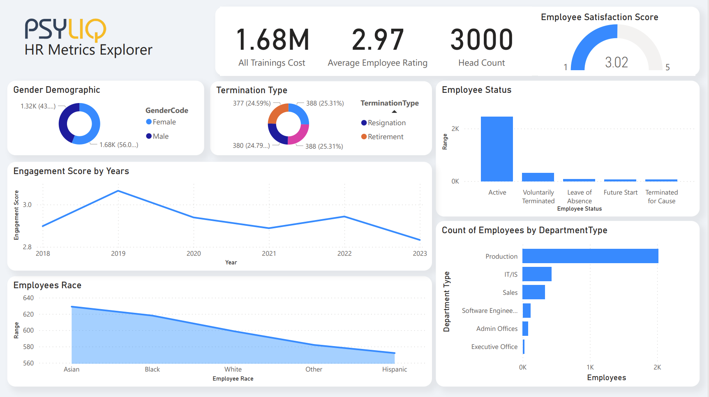
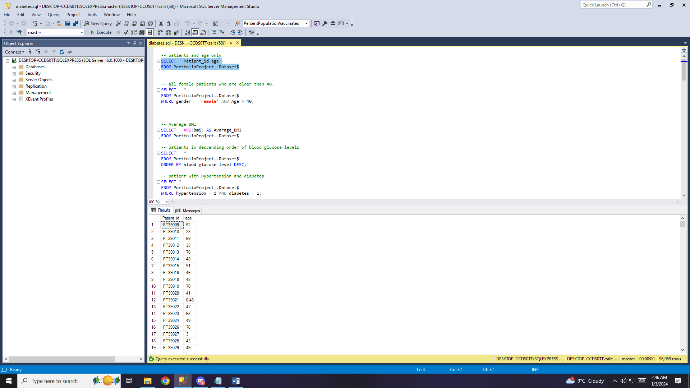
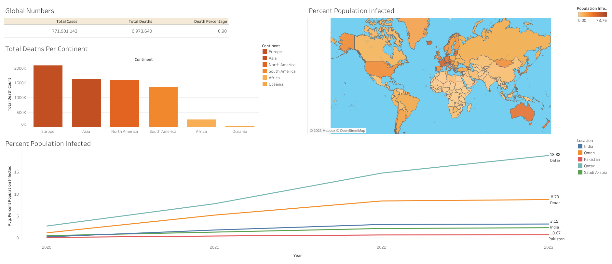
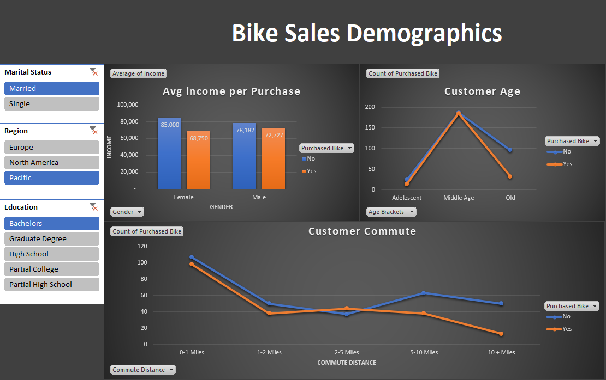

# Usama Ali Data Analyst Portfolio

Welcome to my data analyst portfolio! Explore my projects, skills, and experiences in the field of data analysis.

## Portfolio Sections
- [About Me](#about-me)
- [Projects](#projects)
- [Skills](#skills)
- [Contact](#contact)

## About Me
Accomplished and detail-focused Google Data Analyst certified professional, proficient in data analysis, data visualization, and database management through diverse personal projects. Demonstrates a robust ability to transform intricate datasets into valuable insights, facilitating well-informed business decision-making.

## Projects
List of data analysis projects.
- Human Resource Data Analysis.

  This is my 1st project that i made during my internship at PSYLIQ. Where i used Excel to explore prepare and clean data and used Power BI to display my KPI making it easier to understand and work with.
  (Dataset can't be provided Due to Company privacy) 
  
- Employee HR Metrics

  This is my 2nd Project that i worked during my intership at PSYLIQ. Where i used tools such as Excel and PowerBI to make Dashboard for HR metrics i had to join clean combine data from different resources and surveys.
   (Dataset can't be provided Due to Company privacy) 
  
- Diabetes Prediction Healthcare Data

  This is my 3rd project that i worked on During my Internship at PSYLIQ. In this i Used SQL (Microsoft SQL Server) To Analyze the dataset explore it and find important connection and links betweens crucial data points for Diabetes Healthcare.
  (Dataset can't be provided Due to Company privacy) 
  [Github Link](https://github.com/GlobalMid/Diabetes-Data-SQL-project-)

  

## Personal Projects
  These are some of the Projects i worked on eariler.

- Covid Public Data (DEATHS AND VACCINATION)
 
  what i have done in this project is. Analyzing Public Data on COVID-19 Statistics (Deaths and Vaccinations) Preparing Public Data for In-depth Analysis and Formatting for Visualization Creating a COVID-19 Dashboard Using Tableau for Comprehensive Data Presentation.
  [Github Link](https://github.com/GlobalMid/Covid-Public-data-)
  

- Bike Sales Analysis

  Employed Excel to enhance data set clarity through cleaning processes Generated pivot tables and pivot charts to extract valuable insights (on the basis of income, commute, age brackets) Designed and tailored a dashboard for bike sale.
  [Github Link](https://github.com/GlobalMid/Bike-sales-Analysis-)
  

- Nashville Housing Data
  In this project i worked on Addressing Data Quality in Nashville Housing Data. Utilizing SQL for Data Cleaning and Rectifying Issues. Cleaning and Fixing Data Anomalies in Nashville Housing Dataset.
  [Github Link](https://github.com/GlobalMid/Housing-Data-cleaning-)

## Skills
 Data Analysis Skills.
- SQL (Microsoft SQL Server)
- Excel (VLookup, HLookup, XLookup Conditional 
  Formatting, Pivot Tables, Pivot Charts, Dashboards)
- Microsoft Power BI (Importing Data, Power Query, 
  DAX, Dashboards, Reports)
- Sample Size Determination
- Data Cleansing
- Data Integrity 
- Data Aggregation
- Data Ethics
- Tableau (Dashboards)

## Contact
Feel free to reach out to me at [Gmail](mailto:usamakhan4254@gmail.com)  [LinkedIn](https://www.linkedin.com/in/usama-ali-analyst/)
